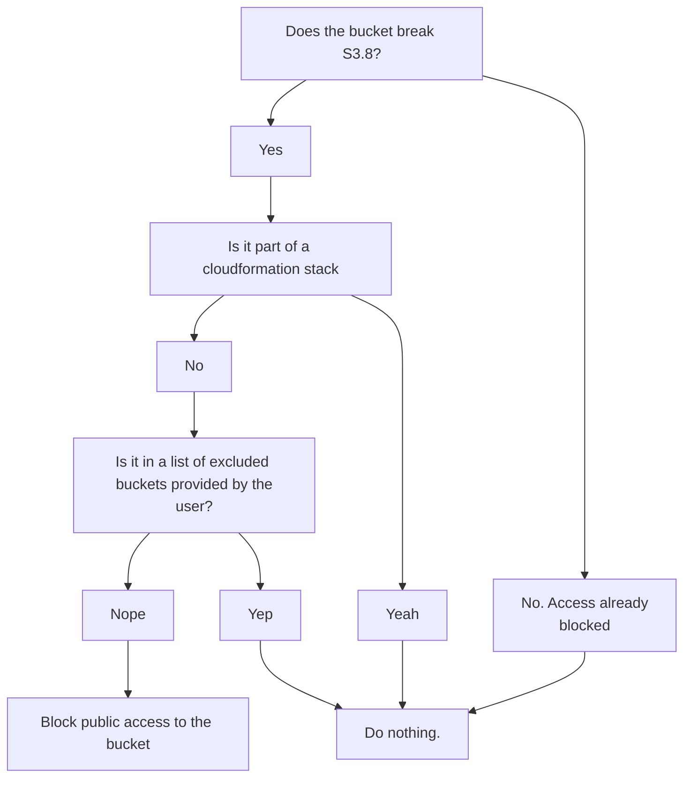
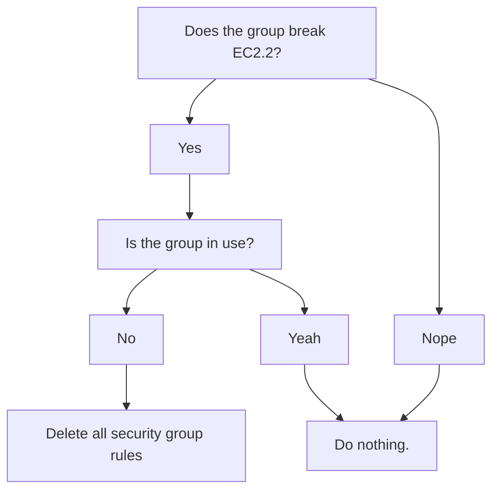
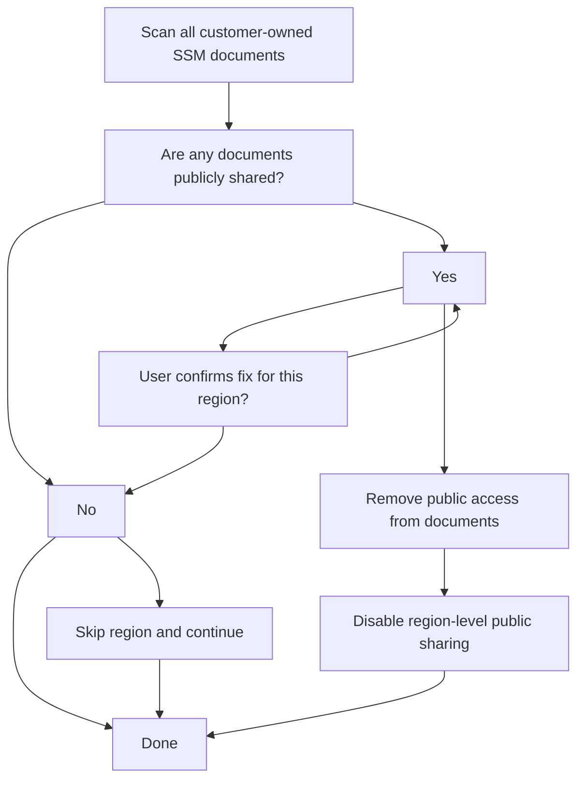

# FSBP tools

## What is this thing?

fsbp-fix is a tool that searches for and automatically remediates auto-fixable violations of the [AWS FSBP standard](https://docs.aws.amazon.com/securityhub/latest/userguide/fsbp-standard.html). Currently, just [S3.8](https://docs.aws.amazon.com/securityhub/latest/userguide/s3-controls.html#s3-8), which states that all buckets should have individual configurations blocking public access, and [EC2.2](https://docs.aws.amazon.com/securityhub/latest/userguide/ec2-controls.html#ec2-2), which states that default security groups in VPCs should not allow any inbound or outbound traffic, are supported.

## Installation

```bash
brew tap guardian/homebrew-devtools && \
brew install fsbp-fix
```

## S3.8 - S3 general purpose buckets should block public access

### Usage

The minimal flags required to resolve S3.8 are as follows. This will execute in dry run mode.

```bash
fsbp-fix S3.8 -profile <PROFILE> -region <REGION> [OPTIONAL_FLAGS]
```

<details>
  <summary>Details</summary>
### Function

First, we find all the buckets that are breaking this rule. It skips over any that are in CloudFormation stacks (to avoid introducing stack drift), and then blocks public access to the remaining buckets.



There are a few extra features, controlled by flags, enumerated below.
</details>

<details>
    <summary>CLI options</summary>
s3.8 takes the following flags:

- **profile**: _Required._ The profile to use when connecting to AWS. 

- **region**: _Optional._ The region you want to search in. If not
specified, it will run in all enabled regions.

- **execute**: _Optional._ Takes no value. If present, it will ask the user to confirm, then block the buckets. If not, it will only print
  the buckets that would have been blocked.

- **exclusions**: _Optional._ Comma-delimited list of buckets to exclude from blocking.

- **max**: _Optional._ The maximum number of buckets to block. Between 1
  and 100. Defaults to 100, which is the maximum number of buckets that can
  exist in an AWS account.

You will also need credentials for the relevant AWS account from Janus.
</details>

<details>
    <summary>Local development</summary>
While developing locally, you can test the application using the following
command from the bucket-blocker subdirectory, without needing to build the binary:

```bash
go run main.go s3.8 -profile <PROFILE> -region <REGION> [OPTIONAL_FLAGS]
```

</details>

## EC2.2 - VPC default security groups should not allow inbound or outbound traffic

### Usage

The minimal flags required to resolve EC2.2 are as follows. This will execute in dry run mode.

```bash
fsbp-fix ec2.2 -profile <PROFILE> -region <REGION> [OPTIONAL_FLAGS]
```

<details>
  <summary>Details</summary>
AWS Security Hub Control [EC2.2](https://docs.aws.amazon.com/securityhub/latest/userguide/ec2-controls.html#ec2-2) states that default security groups in VPCs should not allow any inbound or outbound traffic.

The tool will search for relevant security groups that are not compliant with this control, and check to see if the security group is being used. If the group is not in use, it will remove the offending ingress/egress rules.



</details>

<details>
    <summary>CLI options</summary>
ec2.2 takes the following flags:

- **profile**: _Required._ The profile to use when connecting to AWS. 

- **region**: _Optional._ The region you want to search in. If not
specified, it will run in all enabled regions.

- **execute**: _Optional._ Takes no value. If present, it will ask the user to confirm, then delete the rules. Otherwise, it will just list the rules that would have been deleted.

</details>

<details>
    <summary>Local development</summary>
While developing locally, you can test the application using the following
command from the ingress-inquisitor subdirectory, without needing to build the binary:

```bash
go run main.go ec2.2 -profile <PROFILE> -region <REGION> [OPTIONAL_FLAGS]
```

</details>

<details>
    <summary>FAQ</summary>
### FAQ

#### How do we know if a security group is being used?

Security groups are associated with resources such as EC2 instances, databases, etc via an Elastic Network Interface (ENI). Ingress inquisition queries the AWS API to check all ENIs in the region, and if a security group is associated with an ENI, it is considered in use, and the rules will not be deleted.

</details>

## SSM.7 - SSM documents should have the block public sharing setting enabled

### Usage

The minimal flags required to resolve SSM.7 are as follows. This will execute in dry run mode.

```bash
fsbp-fix ssm.7 -profile <PROFILE> -region <REGION> [OPTIONAL_FLAGS]
```

<details>
  <summary>Details</summary>
AWS Security Hub Control [SSM.7](https://docs.aws.amazon.com/securityhub/latest/userguide/ssm-controls.html#ssm-7) requires that SSM documents are not publicly shared.

The tool scans all customer-owned SSM documents in each region to identify any that are publicly shared. If public documents are found, it can remove the public sharing permissions from individual documents and disable public sharing at the region level.



**Important:** When public documents are found in execute mode, you will be prompted to fix each region individually. This allows you to skip regions that need investigation and continue processing other regions.

</details>

<details>
    <summary>CLI options</summary>
ssm.7 takes the following flags:

- **profile**: _Required._ The profile to use when connecting to AWS. 

- **region**: _Optional._ The region you want to check. If not specified, it will run in all enabled regions.

- **execute**: _Optional._ Takes no value. If present, it will prompt for confirmation per region, then remove public access from documents and disable region-level public sharing. Otherwise, it will display a summary of public documents found across all regions.

You will also need credentials for the relevant AWS account from Janus.
</details>

<details>
    <summary>Local development</summary>
While developing locally, you can test the application using the following command, without needing to build the binary:

```bash
go run main.go ssm.7 -profile <PROFILE> -region <REGION> [OPTIONAL_FLAGS]
```

</details>

<details>
    <summary>FAQ</summary>
### FAQ

#### What does this control actually fix?

SSM.7 ensures that SSM documents are not publicly accessible. The tool:
1. Scans all customer-owned documents (Owner: Self) for public sharing permissions
2. Removes the "all" account from document share permissions
3. Disables public sharing at the region level via the service setting `/ssm/documents/console/public-sharing-permission`

#### Why does it ask for confirmation per region?

When running with `-execute`, if public documents are found in a region, you'll be prompted to confirm fixes for that region. This allows you to:
- Investigate why documents are public before fixing
- Skip specific regions while continuing to process others
- Maintain granular control over multi-region operations

#### What if I skip a region?

If you choose not to fix a region when prompted, that region will be skipped and the tool will continue processing remaining regions. A summary at the end will show all public documents found across all regions.

</details>

## Local development

When committing your changes, please use the
[conventional commit](https://www.conventionalcommits.org/en/v1.0.0/#summary)
format. This will allow us to automatically generate a changelog and correctly
version the application when it is released.

## Releasing to brew

Creating a new release of the application on brew, is currently a manual
process. You will need to update the version, urls, and SHAs in
[homebrew-devtools](https://github.com/guardian/homebrew-devtools). The SHAs are generated by running `shasum -a 256 <filename>` on the binary, or by checking the annotations on the release step in the GitHub Actions workflow.
