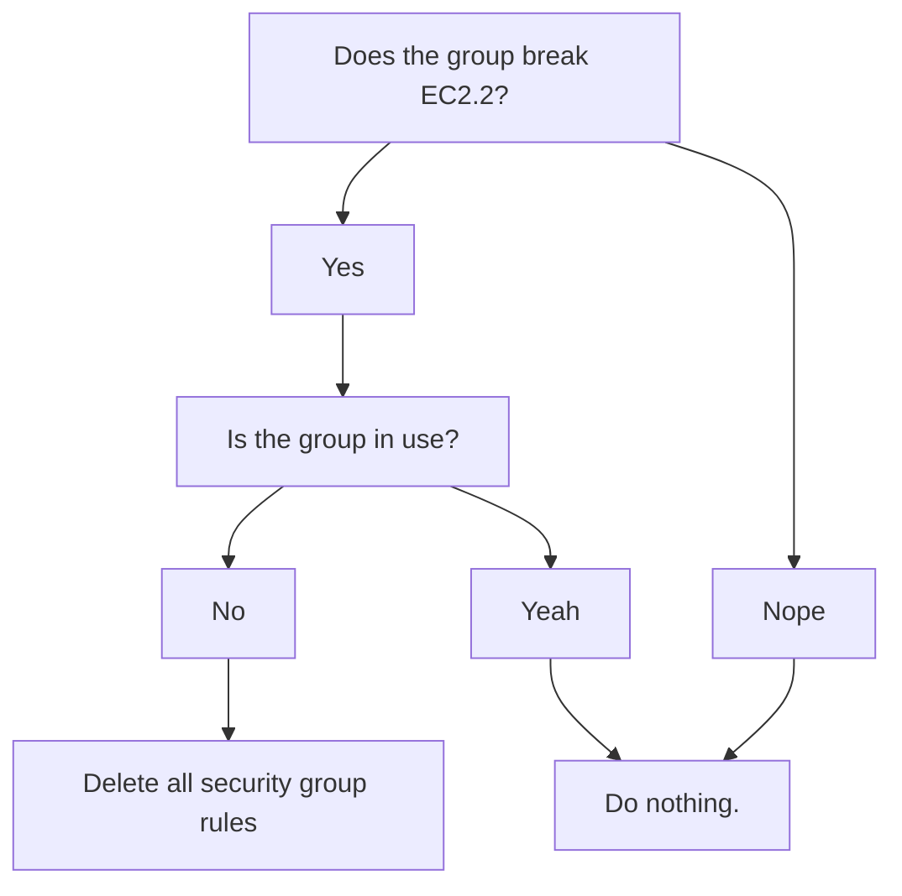

# FSBP Fix

## What is this thing?

fsbp-fix is a tool that searches for and automatically remediates all fixable violations of the AWS FSBP standard. Currently, just [S3.8](https://docs.aws.amazon.com/securityhub/latest/userguide/s3-controls.html#s3-8), which states that all buckets should have individual configurations blocking public access, and [EC2.2](https://docs.aws.amazon.com/securityhub/latest/userguide/ec2-controls.html#ec2-2), which states that default security groups in VPCs should not allow any inbound or outbound traffic, are supported.

## Releasing to brew

Creating a new release of the application on brew, is currently a manual
process. You will need to update the version, urls, and SHAs in
[homebrew-devtools](https://github.com/guardian/homebrew-devtools). The SHAs are generated by running `shasum -a 256 <filename>` on the binary, or by checking the annotations on the release step in the GitHub Actions workflow.

## S3.8

Once it's found the buckets that are not compliant, it skips over any that are in CloudFormation stacks (to avoid introducing stack drift), and then blocks public access to the remaining buckets.


There are a few extra features, controlled by flags, enumerated below.

### Command line options

fsbp-fix takes a subcommand and up to 3 flags:

- **profile**: _Required._ The profile to use when connecting to AWS.

- **region**: _Required._ The region you want to search in.

- **execute**: _Optional._ Takes no value. If present, it will ask the user to confirm, then block the buckets. If not, it will only print
  the buckets that would have been blocked.

- **exclusions**: _Optional._ Comma-delimited list of buckets to exclude from blocking.

- **max**: _Optional._ The maximum number of buckets to block. Between 1
  and 100. Defaults to 100, which is the maximum number of buckets that can
  exist in an AWS account.

You will also need credentials for the relevant AWS account from Janus.

### Local development

While developing locally, you can test the application using the following
command from the bucket-blocker subdirectory, without needing to build the binary:

```bash
go run main.go S3.8 -profile <PROFILE> -region <REGION> [OPTIONAL_FLAGS]
```

## EC2.2

AWS Security Hub Control [EC2.2](https://docs.aws.amazon.com/securityhub/latest/userguide/ec2-controls.html#ec2-2) states that default security groups in VPCs should not allow any inbound or outbound traffic. VPCs set up recently are compliant by default, but older VPCs are not.

The tool will search for relevant security groups that are not compliant with this control, and check to see if the security group is being used. If the group is not in use, it will remove the offending ingress/egress rules.



### Command line options

ingress-inquisition takes the following flags:

- **profile**: _Required._ The profile to use when connecting to AWS.

- **region**: _Required._ The region you want to search in.

- **execute**: _Optional._ Takes no value. If present, it will ask the user to confirm, then delete the rules. Otherwise, it will just list the rules that would have been deleted.

### Local development

While developing locally, you can test the application using the following
command from the ingress-inquisitor subdirectory, without needing to build the binary:

```bash
go run main.go EC2.2 -profile <PROFILE> -region <REGION> [OPTIONAL_FLAGS]
```

### FAQ

#### How does ingress-inquisition know if a security group is being used?

Security groups are associated with resources such as EC2 instances, databases, etc via an Elastic Network Interface (ENI). Ingress inquisition queries the AWS API to check all ENIs in the region, and if a security group is associated with an ENI, it is considered in use, and the rules will not be deleted.
