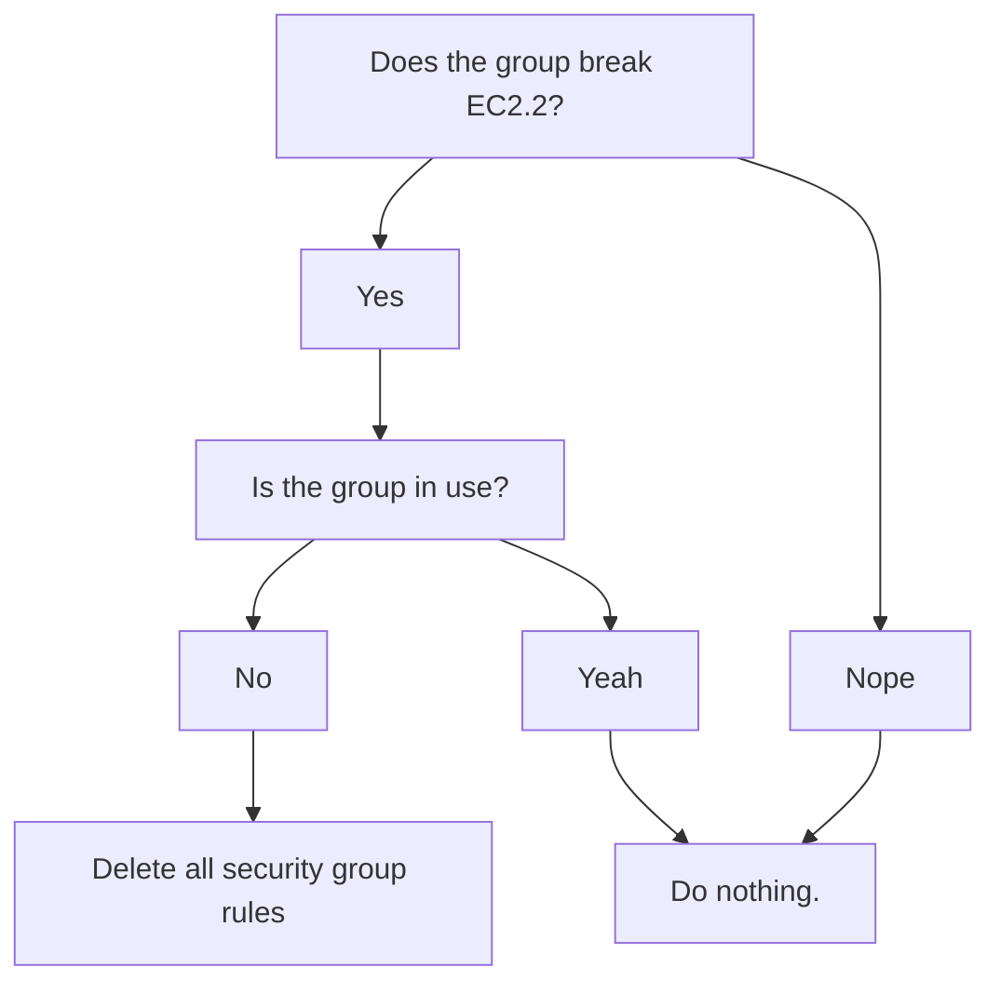

# ingress-inquisition

## What is this thing?

ingress-inquisition is a tool that searces for violations of
[FSBP EC2.2](https://docs.aws.amazon.com/securityhub/latest/userguide/ec2-controls.html#ec2-2),
which states that default security groups in VPCs should not have ingress or
egress rules. Old VPCs were usually configured this way by default, new VPCs
will not, so typically this will just clean up old VPCs with no ongoing work.

Once it's found security groups that are not compliant, it skips over any that
are associated with an Elastic Network Interface (ENI) to avoid breaking
things, and then deletes the offending rules.



There are a few extra features, controlled by flags, enumerated below.

## Command line options:

Bucket blocker takes the following flags:

- **profile**: _Required._ The profile to use when connecting to AWS.

- **region**: _Required._ The region where the bucket is located.

- **execute**: _Optional._ Takes no value. If present, it will ask the user to confirm, then delete the rules.

## Local development

While developing locally, you can test the application using the following
command from the ingress-inquisitor subdirectory, without needing to build the binary:

```bash
go run main.go -profile <PROFILE> -region <REGION> [OPTIONAL_FLAGS]
```
