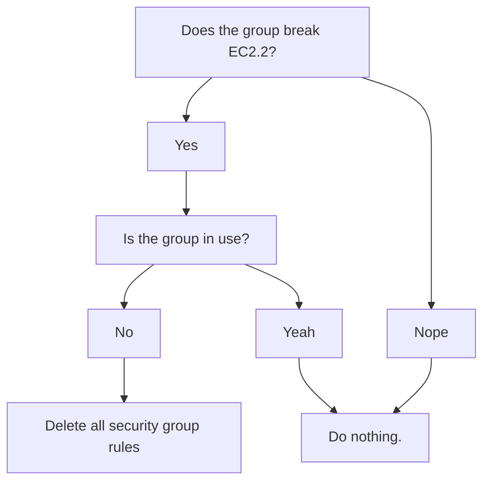

# ingress-inquisition

## What is this thing?

AWS Security Hub Control [EC2.2](https://docs.aws.amazon.com/securityhub/latest/userguide/ec2-controls.html#ec2-2) states that default security groups in VPCs should not allow any inbound or outbound traffic. VPCs set up recently are compliant by default, but older VPCs are not.

ingress-inquisition will search for relevant security groups that are not compliant with this control, and check to see if the security group is being used. If the group is not in use, it will remove the offending ingress/egress rules.



## Command line options:

ingress-inquisition takes the following flags:

- **profile**: _Required._ The profile to use when connecting to AWS.

- **region**: _Required._ The region you want to search in.

- **execute**: _Optional._ Takes no value. If present, it will ask the user to confirm, then delete the rules.

## Running

You can install and run ingress-inquisition using Homebrew:

```bash
brew tap guardian/homebrew-devtools && \
brew install ingress-inquisition && \
ingress-inquisition -profile <PROFILE> -region <REGION> [OPTIONAL_FLAGS]
```

You can also download the binary directly from the Releases page on GitHub, or
build it from source.

## Local development

While developing locally, you can test the application using the following
command from the ingress-inquisitor subdirectory, without needing to build the binary:

```bash
go run main.go -profile <PROFILE> -region <REGION> [OPTIONAL_FLAGS]
```

## Releasing to brew

Creating a new release of the application on brew, is currently a manual
process. You will need to update the version, urls, and SHAs in
[this file](https://github.com/guardian/homebrew-devtools/blob/main/Formula/ingress-inquisition.rb)
in the homebrew-devtools repo. The SHAs are generated by running `shasum -a 256 <filename>` on the binary, or by checking the annotations on the release step in the GitHub Actions workflow.

## FAQ

### How does ingress-inquisition know if a security group is being used?

Security groups are associated with resources such as EC2 instances, databases, etc via an Elastic Network Interface (ENI). Ingress inquisition checks all ENIs in the region, and if a security group is associated with an ENI, it is considered in use, and the rules will not be deleted.
